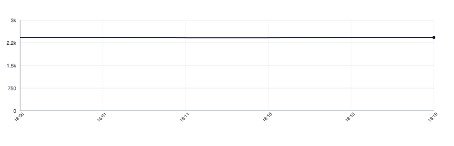

[](https://github.com/botforge-pro/lettermark-kotlin/actions/workflows/tests.yml)
[](https://botforge-pro.github.io/lettermark-kotlin/)

# lettermark-kotlin

The mark a thing gets when it has no picture of its own: the letters that go in
the square, and which of the palette's colour slots it is drawn on.

```kotlin
import pro.botforge.lettermark.Palette
import pro.botforge.lettermark.initials

val letters = initials(name)

val marks = Palette(slots = 12)  // however many colours your theme paints
val slot = marks.slot(id)        // 0 … marks.slots - 1
```

The palette is not here, and neither is its size. A caller keeps its own — a
colour resource file, a theme, a stylesheet — and says how many colours are in
it when it builds the palette. That keeps one thing in one place: the rule
here, the colours where the rest of the design lives, the count beside them.

Build it once, with the rest of your setup. A count below 1 is refused, because
a palette that paints nothing means the code and the theme disagree, and the
place to hear that is startup rather than the middle of a screen.

The same id always answers the same slot, so a thing keeps its colour between
screens and between runs — for as long as the palette holds the same number of
colours. Painting one more or one fewer moves almost everything to a different
colour, which readers notice.

`initials` is given the name a reader sees. A caller holding markup strips it
first; this library does not know what markup its caller writes.

## Segmentation is ours, not the platform's

The first "letter" of a name may be a Devanagari conjunct, a Khmer syllable, a
Hangul block or an emoji sequence, so the rule needs extended grapheme clusters
as defined by [UAX #29](https://www.unicode.org/reports/tr29/). This library
carries its own table, generated from the Unicode Character Database, rather
than asking the platform.

The platform cannot answer this question the same way twice. `java.text` and
`java.util.regex` are reimplemented on top of ICU in Android, so the same call
gives the JDK's answer in a unit test and the phone's ICU in production, and
that ICU is whichever one the OS shipped — Unicode 8.0 on API 24, 15.1 on API
35. Bundling ICU4J instead costs around 11 MB of download for the 14 KB of
rules actually used. The table here is 4.5 KB, and it answers every case of the
Unicode 16.0 `GraphemeBreakTest`, in CI and on every device alike.

`make unicode-sync` regenerates the table and the conformance suite from a
pinned Unicode version. A character assigned after that version is read by the
same rules with the data we hold, so an emoji sequence newer than the pinned
Unicode may come apart until the table is regenerated.

## Installation

```kotlin
dependencies {
    implementation("pro.botforge:lettermark-kotlin:0.2.0")
}
```

## Ports

This is the Kotlin port of [lettermark](https://github.com/botforge-pro/lettermark),
the Go repository the ports follow.

- Go — [lettermark](https://github.com/botforge-pro/lettermark)
- Swift — [lettermark-swift](https://github.com/botforge-pro/lettermark-swift)
- Kotlin — this repository

`cases.yaml` is the contract. It lives in the leading repository, this port
carries a copy under `src/test/resources`, and a test compares that copy with
the leading repository byte for byte, so a case added there is answered here or
fails loudly. `make sync-corpus` brings a fresh copy over.

## Lines of Code

<picture>
  <source media="(prefers-color-scheme: dark)" srcset=".github/loc-history-dark.svg">
  <source media="(prefers-color-scheme: light)" srcset=".github/loc-history-light.svg">
  
</picture>
